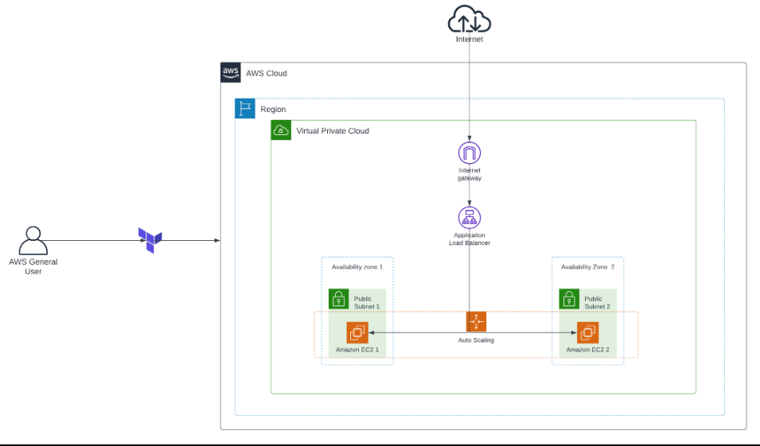

Got it! Here's the revised README.md focusing on the one-tier autoscaling architecture:

---

# Terraform Infrastructure as Code (IaC) Project

This project deploys a one-tier autoscaling architecture on AWS using Terraform. The architecture includes networking components such as VPC, subnets, internet gateway, security groups, an application load balancer (ALB), and EC2 instances managed by an auto-scaling group.

## Table of Contents
- [Terraform Infrastructure as Code (IaC) Project](#terraform-infrastructure-as-code-iac-project)
  - [Table of Contents](#table-of-contents)
  - [Prerequisites](#prerequisites)
  - [Project Structure](#project-structure)
  - [Getting Started](#getting-started)
  - [Variables](#variables)
  - [Customization](#customization)
  - [Outputs](#outputs)
  - [Key features of this project include:](#key-features-of-this-project-include)
  - [Architecture Diagram](#architecture-diagram)
  - [Configuration Overview](#configuration-overview)
    - [Provider configuration](#provider-configuration)
    - [Terraform Block:](#terraform-block)
    - [Provider Block:](#provider-block)
    - [Network Configuration](#network-configuration)
    - [Keypair](#keypair)
    - [Load balancer](#load-balancer)
    - [Launch template](#launch-template)
      - [User data](#user-data)
    - [Autoscaling group](#autoscaling-group)
    - [Security Group](#security-group)
    - [Output File](#output-file)
  - [Understanding the security risk of exposing the "tfvars file"](#understanding-the-security-risk-of-exposing-the-tfvars-file)
    - [tfvars file](#tfvars-file)
  - [Usage](#usage)
  - [After successful deployment](#after-successful-deployment)
  - [Cleanup](#cleanup)
  - [References](#references)
  - [Contributing](#contributing)
  - [License](#license)

## Prerequisites
Before using this Terraform configuration, ensure you have the following prerequisites:

- **AWS Account**: You must have an AWS account with appropriate permissions to create and manage resources.
- **Terraform Installation**: Terraform must be installed on your local machine. You can download Terraform from [here](https://www.terraform.io/downloads.html) and follow the installation instructions.
- Familiarity with Terraform and infrastructure as code principles.<br>
- An IDE (VS Code Editor) .<br>

## Project Structure
- **provider.tf**: Configures the AWS provider for Terraform.
- **network.tf**: Defines the networking components including VPC, subnets, internet gateway, and route table.
- **launch-template.tf**: Creates a launch template for EC2 instances.
- **autoscaling-group.tf**: Configures an auto-scaling group to manage EC2 instances.
- **security-groups.tf**: Sets up security groups for the load balancer and auto-scaling group.
- **alb.tf**: Defines an application load balancer, target group, and listener.
- **keypair.tf**: Auto create the keypair and download a copy to the local system in a specified directory. 
- **user-data.sh**: Bash script to configure EC2 instances.
- **variables.tf**: Declares variables used in the project.
- **output.tf**: Outputs the DNS name of the load balancer.

## Getting Started
1. Clone this repository to your local machine.
2. Navigate to the project directory.
3. Initialize Terraform by running `terraform init`.
4. Modify the `terraform.tfvars` file with your desired configurations.
5. Apply the Terraform configuration using `terraform apply`.

## Variables
- **region**: AWS region where the infrastructure will be deployed.
- **project_name**: Name of the project used for resource tagging.
- **vpc_cidr_block**: CIDR block for the VPC.
- **public_subnet_1_cidr_block**: CIDR block for the public subnet.
- **public_subnet_1_az**: Availability zone for the public subnet.
- **lb_sg_name**: Name of the security group for the load balancer.
- **tg_name**: Name of the target group for the load balancer.
- **lb_name**: Name of the application load balancer.
- **keypair_name**: Name of the SSH key pair used for EC2 instances.
- **asg_sg_name**: Name of the security group for the auto-scaling group.

## Customization
You can customize the project by modifying the variables in the `terraform.tfvars` file to suit your requirements. Additionally, you can adjust other configurations in the Terraform files according to your needs.

## Outputs
- **DNS**: DNS name of the application load balancer, which can be used to access the deployed application by copying the outputed DNS name to the browser to access the instance through the loadbalancer and it rotate the instances upon refresh of the page.

## Key features of this project include:
1. **Auto Scaling Groups (ASG):** I set up Auto Scaling Groups to dynamically adjust the number of instances based on traffic patterns, ensuring optimal resource utilization and reliability.
2. **Elastic Load Balancers (ELB):** Elastic Load Balancers are used to evenly distribute incoming traffic across multiple instances, eliminating single points of failure and enhancing availability.
3. **Fault Tolerance:** Our infrastructure is designed to be fault-tolerant, capable of withstanding component failures without causing downtime. This is achieved through redundancy and failover mechanisms.
4. **Virtual Private Cloud (VPC):** For a dedicated virtual network for my resources, isolated from other AWS accounts.
5. **Subnets:** For subdivisions of the VPC to host my instances in different availability zones.
6. **Internet Gateway (IG):** To allow communication between your VPC and the public internet.
7. **Route Tables:** Defining routing rules to direct traffic within the VPC and to the IG.

## Architecture Diagram


## Configuration Overview

The Terraform configuration is organized into several files and directories, each responsible for provisioning specific components of the two-tier architecture.
### Provider configuration

Let's break down the Terraform code in `provider.tf`:

### Terraform Block:

1. **Terraform Block**:
   - Description: The `terraform` block defines the required providers for the Terraform configuration. It specifies that this configuration requires the AWS provider from HashiCorp.

   ```hcl
   terraform {
     required_providers {
       aws = {
         source  = "hashicorp/aws"
         version = "~> 5.0"
       }
     }
   }
   ```

   - This block ensures that the AWS provider is available and at least version 5.0 or higher is used.

### Provider Block:

2. **AWS Provider Block**:
   - Description: The `provider` block configures the AWS provider. It specifies the region where resources will be provisioned and the AWS profile to use for authentication.

   ```hcl
   provider "aws" {
     region  = var.region
     profile = "developer"
   }
   ```

   - `region`: Specifies the AWS region where resources will be created. It is set dynamically using the value of the `region` variable.
   - `profile`: Specifies the AWS profile to use for authentication. In this case, it's set to "developer".

By configuring the provider in this way, Terraform will use the AWS provider from HashiCorp, ensure it meets the required version, and use the specified region and profile for resource provisioning and authentication, respectively.

### Network Configuration

- **`vpc.tf`**: This file defines the Virtual Private Cloud (VPC), subnets, internet gateway, and route tables. It ensures network isolation and sets up the routing infrastructure for the architecture.
  
Let's explain each output defined in the `vpc.tf` file:

1. **AWS VPC (Virtual Private Cloud)**:
   - Resource Type: `aws_vpc`
   - Description: Creates a Virtual Private Cloud (VPC) in AWS, which allows you to provision a logically isolated section of the AWS Cloud where you can launch AWS resources.
   - Attributes:
     - `cidr_block`: The CIDR block for the VPC, defining its IP address range.
     - `tags`: Tags applied to the VPC for identification and organization.

2. **AWS Subnets**:
   - Resource Types: `aws_subnet`
   - Description: Creates subnets within the VPC to divide the IP address space and isolate resources.
   - Attributes:
     - `vpc_id`: The ID of the VPC in which the subnet will be created.
     - `cidr_block`: The CIDR block for the subnet, defining its IP address range.
     - `availability_zone`: The availability zone in which the subnet will be created.
     - `map_public_ip_on_launch`: Specifies whether instances launched in the subnet should be assigned public IP addresses automatically.
     - `tags`: Tags applied to the subnet for identification and organization.

3. **AWS Internet Gateway**:
   - Resource Type: `aws_internet_gateway`
   - Description: Creates an internet gateway, which allows communication between instances in your VPC and the internet.
   - Attributes:
     - `vpc_id`: The ID of the VPC to which the internet gateway will be attached.
     - `tags`: Tags applied to the internet gateway for identification and organization.

4. **AWS Route Table**:
   - Resource Type: `aws_route_table`
   - Description: Creates a route table, which specifies how network traffic is directed within the VPC.
   - Attributes:
     - `vpc_id`: The ID of the VPC to which the route table will be associated.
     - `route`: Defines a route in the route table, specifying the destination CIDR block and the target (in this case, an internet gateway).
     - `tags`: Tags applied to the route table for identification and organization.

5. **Route Table Associations**:
   - Resource Types: `aws_route_table_association`
   - Description: Associates the public subnets with the route table to define the routing for traffic leaving the subnets.
   - Attributes:
     - `subnet_id`: The ID of the subnet to associate with the route table.
     - `route_table_id`: The ID of the route table to which the subnet will be associated.

These resources collectively define the networking infrastructure for the two-tier architecture, including VPC, subnets, internet gateway, and route tables, enabling communication between resources within the VPC and with the internet. 

### Keypair

Let's break down each resource in the Terraform code for creating a key pair and storing the private key locally:

1. **aws_key_pair (AWS Key Pair)**:
   - This resource creates an AWS key pair, which consists of a public key that AWS stores and a private key that you can download.
   - Attributes:
     - `key_name`: The name of the key pair.
     - `public_key`: The public key to associate with the key pair. In this case, it uses the public key generated from a TLS private key.

2. **tls_private_key (TLS Private Key)**:
   - This resource generates a TLS private key.
   - Attributes:
     - `algorithm`: The algorithm used for generating the private key (in this case, RSA).
     - `rsa_bits`: The number of bits for the RSA key (in this case, 4096 bits).

3. **local_file (Local File)**:
   - This resource generates a local file containing the private key.
   - Attributes:
     - `content`: The content of the file, which is set to the PEM representation of the private key generated by the `tls_private_key` resource.
     - `filename`: The path and filename where the file will be stored locally. In this case, it's stored in the "key" directory with the name "test-app-key.pem" relative to the module's directory.

By utilizing this Terraform configuration, you can create an AWS key pair, generate a private key, and store the private key locally for further use, such as SSH access to instances launched with the associated key pair.

### Load balancer

This Terraform code creates several AWS resources for setting up an Application Load Balancer (ALB) and related components. Here's a breakdown of each resource:

1. **aws_lb (Application Load Balancer)**:
   - This resource creates an AWS Application Load Balancer.
   - Attributes:
     - `name`: The name of the load balancer.
     - `internal`: Specifies whether the load balancer is internal or external.
     - `load_balancer_type`: Specifies the type of load balancer (in this case, "application").
     - `security_groups`: The security groups associated with the load balancer.
     - `subnets`: The subnets in which the load balancer will be deployed.
     - `tags`: Additional tags for identifying the load balancer.

2. **aws_lb_target_group (Target Group)**:
   - This resource creates a target group, which is a logical grouping of targets (instances or services) for the ALB to route requests to.
   - Attributes:
     - `name`: The name of the target group.
     - `port`: The port on which targets receive traffic from the load balancer.
     - `protocol`: The protocol to use for routing traffic to the targets.
     - `vpc_id`: The ID of the VPC in which to create the target group.
     - `health_check`: Configuration for health checks on the targets.

3. **aws_lb_listener (ALB Listener)**:
   - This resource creates a listener for the ALB, which defines how traffic is routed from clients to targets within the target group.
   - Attributes:
     - `load_balancer_arn`: The ARN (Amazon Resource Name) of the load balancer.
     - `port`: The port on which the listener listens for incoming traffic.
     - `protocol`: The protocol used by the listener.
     - `default_action`: Defines the action to take when a request matches the listener's conditions. In this case, it forwards the request to the target group.

These resources collectively set up an ALB with a target group and a listener to route incoming HTTP traffic to the appropriate targets based on the rules defined in the listener configuration.

### Launch template

Let's go through each resource in the Terraform code for creating a launch template:

1. **aws_launch_template (Launch Template)**:
   - This resource defines a launch template, which provides a configuration template for launching EC2 instances with specific settings.
   - Attributes:
     - `name`: The name of the launch template.
     - `image_id`: The ID of the Amazon Machine Image (AMI) to use for the instance.
     - `instance_type`: The type of EC2 instance to launch.
     - `key_name`: The name of the key pair to use for SSH access to the instance.
     - `placement`: Specifies the placement settings for the instance, such as the availability zone.
     - `network_interfaces`: Defines the network interfaces for the instance, including security groups.
     - `user_data`: Specifies the user data script to be executed when the instance launches.
     - `tag_specifications`: Specifies the tags to be applied to the instance.
       - `resource_type`: The type of resource to tag (in this case, "instance").
       - `tags`: Key-value pairs representing the tags to apply, such as the instance name.
 
   - Comments:
     - There are commented-out blocks for `network_interfaces` and `associate_public_ip_address`. These are options for configuring network interfaces, including whether to assign a public IP address to the instance.
By utilizing this Terraform configuration, you can create a launch template with predefined settings for launching EC2 instances. This launch template can then be used in an Auto Scaling Group or other deployment scenarios to ensure consistent configurations for your instances.

#### User data

This bash script performs several actions to configure a server. Here's an explanation of each section:

1. **Update and upgrade the servers**:
   - `apt update && apt upgrade -y`: Updates the package lists for upgrades and installs available upgrades for all installed packages.

2. **Set timezone to Africa/Lagos**:
   - `timedatectl set-timezone Africa/Lagos`: Sets the server's timezone to Africa/Lagos.

3. **Install Apache HTTP Server**:
   - `apt install -y apache2`: Installs the Apache HTTP Server.

4. **Remove existing index.html file**:
   - `rm -f /var/www/html/index.html`: Removes any existing index.html file from the default web directory.

5. **Create index.html file with server information**:
   - Utilizes a here document (`<<EOF`) to generate the index.html file dynamically with server information such as hostname, IP address, operating system, timezone, and current date/time.
   - The hostname, IP address, operating system, and timezone are obtained using commands like `hostname`, `hostname -I`, `hostnamectl`, and `timedatectl`.
   - Includes a JavaScript snippet to display the current date and time, updating every second.

6. **Restart Apache HTTP Server**:
   - `systemctl restart apache2`: Restarts the Apache HTTP Server to apply the changes made to the index.html file.

This script essentially automates the setup of a basic Apache web server with a custom index.html page displaying server information. It ensures that the server is up-to-date, configured with the correct timezone, and has the necessary web server software installed. Additionally, it dynamically generates the content of the index.html file to display relevant server details.


### Autoscaling group

let's break down the Terraform code for creating an Auto Scaling Group (ASG) and its components:

1. **aws_autoscaling_group (Auto Scaling Group)**:
   - This resource defines an Auto Scaling Group, which automatically adjusts the number of instances in response to changing demand or other conditions.
   - Attributes:
     - `name`: The name of the Auto Scaling Group.
     - `desired_capacity`: The desired number of EC2 instances in the group.
     - `max_size`: The maximum number of instances the group can have.
     - `min_size`: The minimum number of instances the group should have.
     - `target_group_arns`: The ARN of the target group(s) where the ASG instances will be registered. This allows the ALB to route traffic to instances in the ASG.
     - `health_check_type`: The type of health check to perform on instances (in this case, "EC2" for checking instance health).
     - `vpc_zone_identifier`: The subnet IDs where the instances will be launched.

2. **launch_template (Launch Template)**:
   - This block specifies the launch template to use for launching instances within the Auto Scaling Group.
   - Attributes:
     - `id`: The ID of the launch template.
     - `version`: The version of the launch template to use. By specifying `latest_version`, it ensures that the ASG uses the latest version of the launch template.

By using this Terraform configuration, you can set up an Auto Scaling Group that maintains a desired number of EC2 instances based on demand, with instances registered to a target group for load balancing purposes. Additionally, it ensures that instances are launched using a specified launch template.

### Security Group

let's break down each resource in the `security-groups.tf` file:

1. **aws_security_group "lb_sg"**:
   - This resource creates a security group named `lb_sg` for the load balancer.
   - **Name**: The name of the security group is defined by the variable `var.lb_sg_name`.
   - **Description**: A description is provided for the security group to indicate its purpose.
   - **VPC ID**: The security group is associated with the VPC defined in `aws_vpc.my_vpc`.
   - **Ingress Rules**:
     - Allows inbound traffic on port 80 (HTTP) from any source (CIDR block `0.0.0.0/0`).
   - **Egress Rules**:
     - Allows all outbound traffic (all ports and protocols) to any destination (CIDR block `0.0.0.0/0`).
   - **Tags**: Adds a tag to the security group for identification purposes, with the name `${var.project_name}_alb_sg`.

2. **aws_security_group "asg_security_group"**:
   - This resource creates a security group named `asg_security_group` for the auto-scaling group.
   - **Name**: The name of the security group is defined by the variable `var.asg_sg_name`.
   - **Description**: A description is provided for the security group to indicate its purpose.
   - **VPC ID**: The security group is associated with the VPC defined in `aws_vpc.my_vpc`.
   - **Ingress Rules**:
     - Allows inbound traffic on port 80 (HTTP) from the security group of the load balancer (`aws_security_group.lb_sg.id`).
   - **Egress Rules**:
     - Allows all outbound traffic (all ports and protocols) to any destination (CIDR block `0.0.0.0/0`).
   - **Tags**: Adds a tag to the security group for identification purposes, with the name "asg-sg".

These security groups control the inbound and outbound traffic for the load balancer and auto-scaling group, ensuring that only the necessary traffic is allowed according to the architecture's requirements. They also provide a level of security by restricting access based on defined rules.

### Output File

- **`outputs.tf`**: Defines outputs for retrieving information about the ALB, such as its DNS name.

Let's explain each output defined in the `outputs.tf` file:

1. **ALB DNS Name**:
   - Output Name: `alb_dns_name`
   - Description: Provides the DNS name of the Application Load Balancer (ALB), which can be used to access the web application.
   - Value: The DNS name of the ALB (`aws_lb.my_lb.dns_name`).
  
These outputs allow users to easily retrieve important information about the deployed infrastructure, such as the ALB DNS name.

## Understanding the security risk of exposing the "tfvars file"

The `terraform.tfvars` file contains sensitive information such as AWS credentials, including access keys, secret keys, and other configuration details necessary to authenticate with the AWS API and provision resources. Exposing this file or its contents can pose significant security risks:

1. **AWS Credentials Exposure**: If unauthorized individuals gain access to the `terraform.tfvars` file, they can obtain AWS access and secret keys. These credentials provide full access to your AWS account and can be used to manipulate resources, incur costs, or access sensitive data.

2. **Potential Data Breach**: If the `terraform.tfvars` file is stored in a repository that is publicly accessible or shared with unauthorized users, it increases the risk of a data breach. Attackers could use the exposed credentials to compromise the AWS account, steal sensitive data, or launch malicious activities.

3. **Unauthorized Resource Provisioning**: With access to AWS credentials, attackers can use Terraform to provision additional resources in the compromised AWS environment. This could result in unexpected costs, infrastructure misconfiguration, or deployment of malicious resources.

4. **Compliance and Regulatory Violations**: Depending on the nature of the data and the industry regulations applicable to your organization, exposing AWS credentials and sensitive configuration information may lead to non-compliance with regulations such as GDPR, HIPAA, or PCI DSS.

To mitigate these security risks, consider the following best practices:

- **Restrict Access**: Limit access to the `terraform.tfvars` file to authorized users only. Use appropriate access controls and permissions to ensure that only trusted individuals can view or modify the file.

- **Secure Storage**: Store the `terraform.tfvars` file securely, preferably outside of version control systems and in a location with restricted access. Consider using secure storage solutions or secrets management tools to store sensitive information encrypted.

- **Rotate Credentials**: Regularly rotate AWS access and secret keys to mitigate the impact of potential credential compromise. Implement automated key rotation policies and practices to ensure that credentials are regularly updated.

- **Use Temporary Credentials**: Avoid hardcoding AWS credentials directly into the `terraform.tfvars` file. Instead, use temporary security credentials, IAM roles, or AWS Identity and Access Management (IAM) instance profiles with limited privileges.

- **Monitor and Audit**: Monitor access to AWS resources, review AWS CloudTrail logs for suspicious activities, and implement auditing mechanisms to detect unauthorized access attempts or changes to resources.

By implementing these security measures, you can reduce the risk of unauthorized access, data breaches, and compliance violations associated with the exposure of sensitive information in the `terraform.tfvars` file.

The file `terraform.tfvars` contains the configuration variables used by Terraform to deploy resources. Let's break down each variable:

### tfvars file

1. **region**:
   - Description: Specifies the AWS region where the resources will be deployed.
   - Example: `"eu-west-1"`
   
2. **project_name**:
   - Description: Name of the project or application. This variable is used for resource naming and tagging.
   - Example: `"one_tier_autoscaling"`
   
3. **vpc_cidr_block**:
   - Description: CIDR block for the Virtual Private Cloud (VPC) that will be created.
   - Example: `"10.0.0.0/16"`
   
4. **public_subnet_1_cidr_block**:
   - Description: CIDR block for the first public subnet.
   - Example: `"10.0.1.0/24"`
   
5. **public_subnet_1_az**:
   - Description: Availability zone for the first public subnet.
   - Example: `"eu-west-1a"`
   
6. **public_subnet_2_cidr_block**:
   - Description: CIDR block for the second public subnet.
   - Example: `"10.0.2.0/24"`
   
7. **public_subnet_2_az**:
   - Description: Availability zone for the second public subnet.
   - Example: `"eu-west-1b"`
   
8. **lb_sg_name**:
   - Description: Name for the security group associated with the Application Load Balancer (ALB).
   - Example: `"one-tier-lb-sg"`
   
9. **keypair_name**:
   - Description: Name for the key pair used for SSH access to EC2 instances.
   - Example: `"test-app-key"`
   
10. **lb_name**:
    - Description: Name for the Application Load Balancer (ALB).
    - Example: `"one-tier-autoscaling-alb"`
    
11. **tg_name**:
    - Description: Name for the target group.
    - Example: `"one-tier-autoscaling-tg"`
    
12. **asg_sg_name**:
    - Description: Name for the security group associated with the Auto Scaling Group (ASG).
    - Example: `"one-tier-autoscaling-sg"`

These variables provide flexibility and customization options for deploying resources using Terraform. They allow you to specify parameters such as region, naming conventions, CIDR blocks, and resource names according to your project requirements and ensure that your AWS credentials and sensitive information are stored securely and not exposed in version control. Consider using tools like AWS Secrets Manager for managing passwords securely.

## Usage

To deploy the one-tier autoscaling architecture, follow these steps:

1. Initialize Terraform:

    ```bash
    terraform init
    ```

2. Validate the setup for errors:

    ```bash
    terraform validate
    ```

3. Review the execution plan:

    ```bash
    terraform plan
    ```

4. Apply the configuration to create resources:

    ```bash
    terraform apply --auto-approve
    ```

## After successful deployment

After successful deployment, you can access the following outputs:

- **ALB DNS Name**: The DNS name of the Application Load Balancer.

## Cleanup

To avoid incurring charges, remember to destroy the resources when no longer needed:

```bash
terraform destroy --auto-approve
```

## References

- Terraform AWS Provider Documentation
- Mathesh-me GitHub Repository


## Contributing

Contributions are welcome! If you find any issues or improvements, feel free to open a pull request.

## License

This Terraform configuration is provided under the [MIT License](LICENSE).